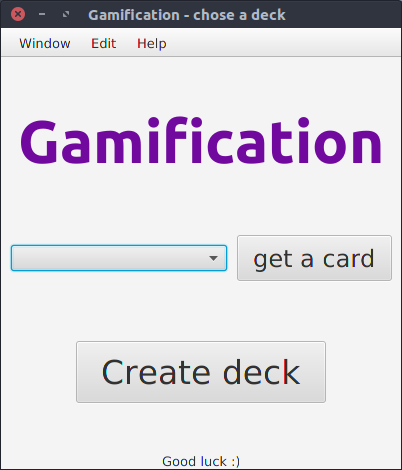
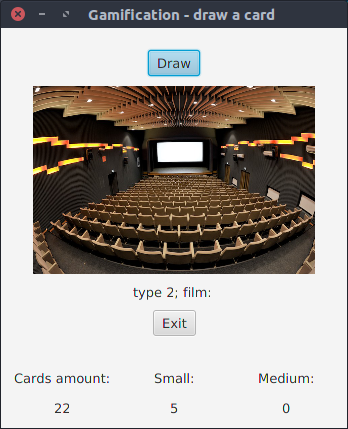
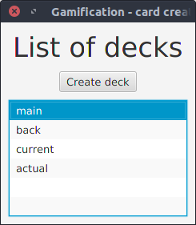
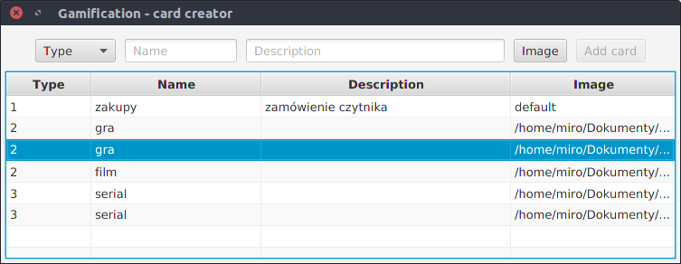

# Gamification (Grywalizacja)
The motivational application uses the "[gamification](https://en.wikipedia.org/wiki/Gamification)" method. 
The program was written in JavaFX technology. This is cross-platform software, you must have installed [java 8](https://java.com/pl/download/) or above to run it. 

### How to use
The application can increase your motivation. The concept is simple - choose
10 awards witch you want to achieve. The awards can be one of 3 types:
- Large › what you want to do most, you can have only one in the set
- Medium › 3 awards in the set
- Small › 6 awards in the set

Every award will be save in the card which can have a name, description and
image (from a url or local sources). Your 9 cards (without a Large award) will
be shuffled with blank cards. The card with a large award will be put at the bottom of the deck.  
After you finish your daily task you can draw one card.  
The application works the best with the "[Pomodoro
Technique](https://cirillocompany.de/pages/pomodoro-technique)". You can draw one card when you will finish 1 or 2 intervals.  

Features:
- creating a deck of cards
- editing cards
- managing decks 
- saving to database

### Used technology
Java 8, JavaFX, Scene Builder, SQLite, ORMLite, JDBC  
The application was written in the MVC pattern.

### Screenshots

  

  

  

  

